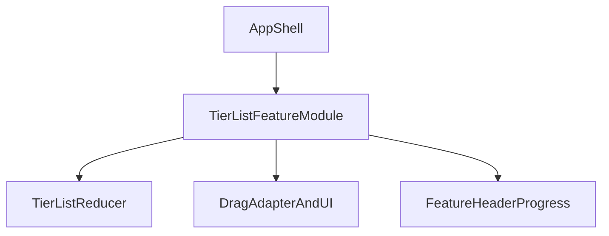

# Deepen Tier List Feature Module

## Goal

Increase Module **Depth** by moving tier-list behavior and UI behind a single feature Seam, so `App.tsx` becomes a thin shell and most change risk has better **Locality**.

## Current friction

- `src/App.tsx` currently mixes shell concerns and tier-list feature implementation.
- The feature Interface is spread across inline components and direct reducer wiring, making the Seam shallow.
- Drag overlay and progress/header behavior are tightly coupled to App-level rendering.

## Target architecture

- Create a `TierListFeature` Module that **owns reducer state** and renders the full tier-list experience (including progress/header for this feature).
- Keep `App.tsx` as shell/layout wrapper only.
- Expose a lean Interface at the Seam: `TierListFeature` component props for shell integration (initially minimal), while internal feature code continues using `state + dispatch`.

## File-level plan

- Update [`/Users/joshkoter/Repos/tier-list-maker/src/App.tsx`](/Users/joshkoter/Repos/tier-list-maker/src/App.tsx)
  - Remove feature-owned reducer wiring and most tier-list UI implementation.
  - Keep only shell concerns (app container, optional shell chrome not specific to tier-list).
- Add [`/Users/joshkoter/Repos/tier-list-maker/src/tier-list/TierListFeature.tsx`](/Users/joshkoter/Repos/tier-list-maker/src/tier-list/TierListFeature.tsx)
  - Move `useReducer(tierListReducer, initialTierListState)` ownership here.
  - Move feature UI now embedded in `App.tsx` (`TierRow`, `UnrankedSection`, `ItemPill`, progress/header parts).
  - Keep internal Interface between feature UI and reducer as `state + dispatch` for low-risk migration.
- Reuse existing domain and drag Modules:
  - [`/Users/joshkoter/Repos/tier-list-maker/src/tier-list/state.ts`](/Users/joshkoter/Repos/tier-list-maker/src/tier-list/state.ts)
  - [`/Users/joshkoter/Repos/tier-list-maker/src/tier-list/dragCoordinator.tsx`](/Users/joshkoter/Repos/tier-list-maker/src/tier-list/dragCoordinator.tsx)

## Validation plan

- Run lint and build to ensure no regressions after extraction.
- Smoke-check behavior parity:
  - add/remove tiers
  - add/remove/unrank item
  - drag between tiers and within same tier
  - reset flow
- Confirm shell still controls only non-feature concerns.

## Follow-up deepening (optional after parity)

- Introduce an explicit feature-level Interface for shell callbacks/state serialization if needed.
- Extract `createMoveAction` to a dedicated Adapter Module to further deepen drag Seam.
- Consider injecting ID generation into reducer path for test leverage.
